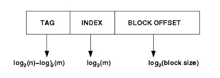
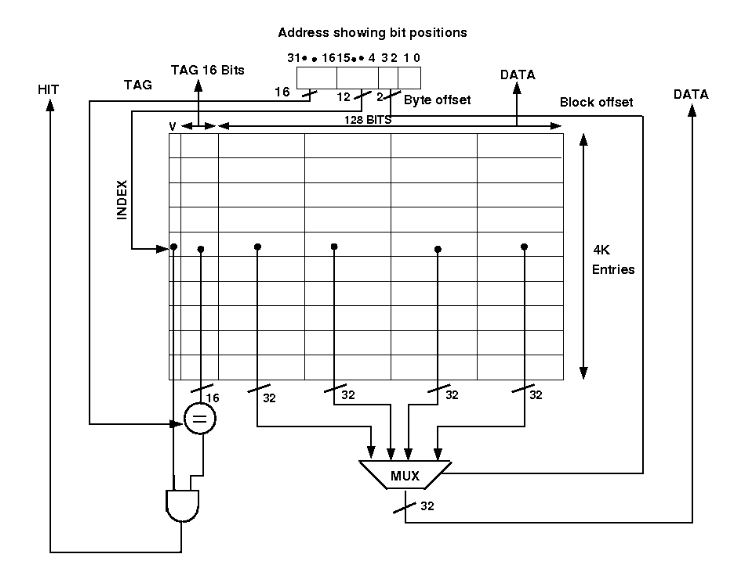
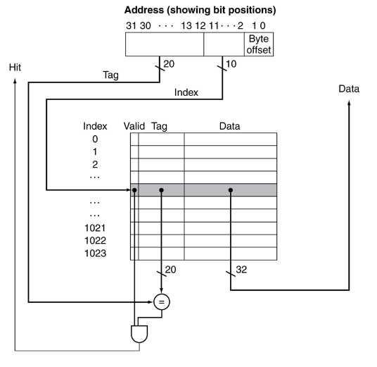
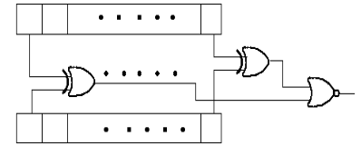

### Theory

**Design of Direct Mapped cache :**

Cache memory is a small (in size) and very fast (zero wait state) memory which sits between the CPU and main memory. The notion of cache memory actually rely on the correlation properties observed in sequences of address references generated by CPU while executing a programm(principle of locality).When a memory request is generated, the request is first presented to the cache memory, and if the cache cannot respond, the request is then presented to main memory.

- **Hit:** a cache access finds data resident in the cache memory
- **Miss:** a cache access does not find data resident, so it forces to access the main memory.
Cache treats main memory as a set of blocks.As the cache size is much smaller than main memory so the number of cache lines are very less than the number of main memory blocks. So a procedure is needed for mapping main memory blocks into cache lines.cache mapping scheme affects cost and performance. There are three methods in block placement-

- **Direct Mapped Cache**
- **Fully Associative Mapped Cache**
- **Set Associative Mapped Cache**

**Direct Mapped Cache**

A given memory block can be mapped into one and only cache line.
**Block identification:** let the main memory contains n blocks(which require log2(n)) and cache contains m blocks, so n/m different blocks of memory can be mapped (at different times) to a cache block. Each cache block has a tag saying which block of memory is currently present in it, each cache block also contain a valid bit to ensure whether a memory block is in the cache block currently.

- Number of bits in the tag: log2(n/m)
- Number of sets in the Cache: m
- Number of bits to identify the correct set: log2(m)

The memory address is divided into 3 parts- tag(most MSB), index, block offset(most LSB) in order to do the cache mapping.

- Select set using index, block from set using tag.
- Select location from block using block offset.
- tag + index = block address

Diagram of a direct mapped cache (here main memory address is of 32 bits and it gives a data chunk of 32 bits at a time):

If a miss occur CPU bring the block from the main memory to the cache, if there is no free block in the corresponding set it replaces a block and put the new one. CPU uses different replacement policies to decide which block is to replace. The disadvantage of the direct mapped cache is that it is easy to build, but suffer the most from thrashing due to the 'conflict misses' giving more miss penalty.

**Design issues:**

Bellow is a simple cache which holds 1024 words or 4KB, memory address is 32 bits. The tag from the cache is compared against the most significant bits of the address to determine whether the entry in the cache corresponds to the requested address as the cache has 210 or 1024 words and a block size of one word, 10 bits are used to index the cache, leaving 32-10-2=20 bits to be compared against the tag. If the tag and the most significant 20 bits of the address are equal and the valid bit is on then the request hits in the cache otherwise miss occurs. No replacement policy has been implemented in the circuit.

The comparator Circuit through which tag is compared with specified bits of address:

